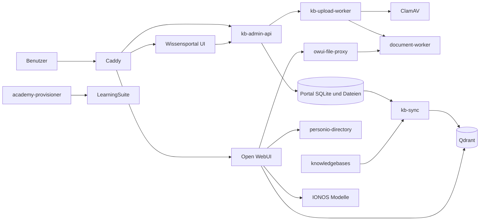

# Architecture

## Scope and Evidence

Dieses Dokument beschreibt den aktuell im Repository nachweisbaren Aufbau von
KAHLE-Vinci. Primäre Quellen sind Compose-Dateien, ausführbarer Code, Tests und
aktuelle Betriebsdokumentation. Ignorierte Runtime-Daten, lokale Rollout-Pakete
und historische Pläne sind keine aktuelle Architektur-Source-of-Truth.

## System Overview

KAHLE-Vinci verbindet ein angepasstes Open WebUI mit einem rollenbasierten
Wissensportal, einer hybriden Wissenssuche, internen Dokumentwerkzeugen und
abgegrenzten Integrationsdiensten. Docker Compose bildet die gemeinsame
Laufzeitgrenze. Caddy stellt in Edge-Konfigurationen die externen Routen bereit.

Das Diagramm zeigt logische Hauptflüsse. Es ersetzt nicht die Mount-, Netzwerk-
und Profildefinitionen in den Compose-Dateien.

## Repository Structure

| Pfad | Verantwortung |
| --- | --- |
| `stack/docker-compose*.yml` | Basis-Stack und Laufzeit-Overlays |
| `stack/kb-admin-api/` | Portal- und klassische Vector-API, Governance, Lifecycle, Ingest, Jobs, Wartung und Backuplogik |
| `stack/kb-sync/` | kanonische Inventarisierung, hybrider Index und Synchronisation nach Qdrant |
| `stack/open-webui-overrides/` | versionsgebundene Open-WebUI-Router- und Middleware-Anpassungen |
| `stack/open-webui-tools/` | getrennte Tool-Quellen und erzeugte, eigenständige Bundles |
| `stack/owui-file-proxy/` | abgesicherte Dateioperationen und Downloadpfade |
| `stack/document-worker/` | DOCX-, PDF- und XLSX-Verarbeitung |
| `stack/academy-provisioner/` | Open-WebUI-basierte LearningSuite-Provisionierung |
| `stack/personio-directory/` | interner, lesender Personio-Verzeichnisdienst |
| `admin-dashboard/` | React-/Vinext-Frontend des Wissensportals |
| `n8n/` | Workflow-Export und lokale n8n-Laufzeitdaten |
| `eval/rag/` | Retrieval-Evaluation und Laufzeitmessung |
| `scripts/` | Verification- und Betriebsskripte |
| `docs/operations/` | aktuelle Betriebsdokumentation |

## Runtime Components

Der Basis-Stack in `stack/docker-compose.yml` enthält folgende Dienste:

| Dienst | Aktuelle Aufgabe |
| --- | --- |
| `open-webui` | Chat-Oberfläche, Microsoft-SSO-Sitzung und KAHLE-Middleware |
| `owui-file-proxy` | abgesicherte Dateiwerkzeuge, Vorlagen und signierte Downloads |
| `kb-admin-api` | Portal-API und klassische Vector-Administration |
| `kb-maintenance` | periodische Portalwartung über dasselbe Backend-Image |
| `kb-upload-worker` | asynchrone Upload- und Ingest-Verarbeitung |
| `kb-backup` | optionaler Backupdienst im Profil `operations` |
| `clamav` | Malware-Scan für den Secure-Ingest-Pfad |
| `kb-admin-dashboard` | statisches beziehungsweise serverseitig gebautes Portal-Frontend |
| `document-worker` | Konvertierung und Bearbeitung unterstützter Dokumentformate |
| `academy-provisioner` | idempotente LearningSuite-Mitgliedschaft und Kursfreigabe |
| `personio-directory` | synchronisiertes, evidenzbegrenztes Mitarbeiterverzeichnis |
| `n8n` | freigegebene Automations- und Websuchworkflows |
| `qdrant` | abgeleitete Vector-Indizes für Wissen und Personio-Verzeichnis |
| `kb-sync` | Synchronisation klassischer und Portalquellen nach Qdrant |
| `searxng` | Such-Backend für den kontrollierten Websuchpfad |

Mehrere Dienste verwenden eigene Images oder Laufzeit-Requirements. Die
gemeinsame Datei `stack/requirements-dev.txt` vereinheitlicht nur die lokale
Verification und ersetzt keine Runtime-Manifeste.

## Application Boundaries

### Edge and presentation

Caddy normalisiert `/wissen` auf `/wissen/`, leitet `/admin/vector` auf diesen
Einstieg um und routet `/wissen/api/*` zur Portal-API. Für Portal-Seiten wird
die bestehende Open-WebUI-Sitzung über `forward_auth` geprüft. Andere Routen
gehen an Open WebUI.

Das Frontend in `admin-dashboard/` lädt aktuell `KnowledgePortal`. Es übernimmt
die Open-WebUI-Sitzung für API-Aufrufe. Rollen- und Rechteentscheidungen bleiben
im Backend. `VectorAdmin` ist weiterhin als klassische Komponente vorhanden,
ist aber nicht der aktuelle Seiteneinstieg.

### Portal backend

`stack/kb-admin-api/app/main.py` bündelt die HTTP-Routen. Fachliche Zustände und
Arbeitsabläufe sind in spezialisierten Modulen organisiert, darunter:

- `portal_governance.py` für Identitäten, Rollen und Knowledge-Base-Rechte;
- `document_lifecycle.py` und `document_authority.py` für Versionen und
  fachliche Autorität;
- `secure_ingest.py`, `upload_jobs.py` und `upload_worker.py` für Uploads;
- `decision_jobs.py`, `document_changes.py` und `quality_cases.py` für
  Freigaben und Nacharbeit;
- `maintenance.py` und `maintenance_worker.py` für Fristen und Wartung;
- `backup_restore.py` und `backup_worker.py` für Portal-Backups;
- `mail_delivery.py` und `outlook_absence.py` für konfigurierbare
  Microsoft-Integrationen.

API-Erweiterungen sollen diese vorhandenen Module nutzen. Neue fachliche Logik
gehört nicht ausschließlich in UI-Komponenten oder Compose-Konfiguration.

### Retrieval and Open WebUI integration

Die Open-WebUI-Overrides enthalten den KAHLE-Wissens-Harness, den internen
Personio-Client und Middleware für Routing und Tool-Ausführung. `kb-sync`
erzeugt aus klassischen und Portalquellen einen hybriden Qdrant-Index sowie
einen BM25-Snapshot. Die ausführbaren Open-WebUI-Tools werden aus getrennten
Quellen unter `stack/open-webui-tools/` in eigenständige Dateien unter `dist/`
gebaut.

### Integration services

`personio-directory` stellt keine allgemeine Personio-API bereit. Der Dienst
synchronisiert Personio lesend, speichert lokalen Sync-Status, indexiert die
freigegebenen Felder in einer eigenen Qdrant-Collection und antwortet nur über
einen internen API-Key-geschützten Suchendpunkt. Der Endpunkt akzeptiert nur die
Open-WebUI-Rollen `user` und `admin`.

`academy-provisioner` liest die Open-WebUI-SQLite-Datenbank nur lesend. Nutzer
mit den Open-WebUI-Rollen `user` oder `admin` sind für die Provisionierung
geeignet. Vor der LearningSuite-Verarbeitung sendet der Dienst ihnen einmalig
eine Willkommensmail über Microsoft Graph. `pending`-Nutzer werden nicht
provisioniert; stattdessen informiert der Dienst jeden aktuellen Open-WebUI-
Admin einmalig über die Zugriffsanfrage und nennt dabei Name und E-Mail-Adresse
des Antragstellers. Die LearningSuite-Kursfreigabe löst anschließend deren
Kurszugangs-E-Mail mit Login-Link aus. Die lokale Zustandsdatenbank macht die
Verarbeitung und die beiden Graph-Mailpfade idempotent.

## Main Data Flows

### Portal access

1. In Produktion authentifiziert Microsoft Entra den Benutzer über Open WebUI.
2. Caddy übernimmt die bestehende Open-WebUI-Sitzung für `/wissen/`.
3. Die Portal-API validiert die Sitzung gegen Open WebUI.
4. Die API prüft erlaubte Domain, aktive Portalidentität, Portalrolle und die
   erforderlichen Lese- oder Uploadrechte.

### Portal document lifecycle

1. Das Portal legt einen Uploadjob und Quarantänedaten an.
2. `kb-upload-worker` übernimmt den Job.
3. Secure-Ingest-Prüfungen, ClamAV und bei Bedarf `document-worker` verarbeiten
   die Datei.
4. Metadaten, Original und aufbereitete Fassung werden im Portalbestand
   gehalten.
5. Rollen-, Freigabe- und Lifecycle-Regeln steuern die Veröffentlichung.
6. `kb-sync` liest freigegebene Portalquellen und aktualisiert Qdrant sowie den
   BM25-Snapshot.
7. Open WebUI verwendet den abgeleiteten Index für Retrieval mit den
   vorgesehenen Zugriffsumfängen.

### Classic knowledge flow

Klassische Vector-Funktionen verwalten Quellen unter `knowledgebases/`.
`kb-sync` liest auch diese Quellen und aktualisiert den abgeleiteten Index.
Dieser Pfad bleibt vom rollenbasierten Portal-Datenmodell getrennt und dient
zusätzlich als kontrollierte Migrationsquelle.

### Generated documents

Open-WebUI-Tools rufen `owui-file-proxy` über einen internen API-Key auf. Der
Proxy nutzt bei unterstützten Operationen `document-worker` und kontrollierte
Arbeitsvolumes. Downloads werden über signierte Links bereitgestellt. Das
Frontend erhält keine Document-Worker- oder Modellzugangsdaten.

### Web search and automation

n8n führt die eingecheckten beziehungsweise importierten Workflows aus und
nutzt SearxNG für den vorgesehenen sicheren Websuchpfad. Der statische Check
prüft den kanonischen Export `n8n/all-workflows.json`.

Für die eingecheckten Retention- und Cleanup-Abläufe besitzt n8n zusätzlich
Schreibzugriff auf die Docker-Volumes `open-webui` und
`document_worker_data`. Klassische Quellen unter `knowledgebases` sind in n8n
nur lesbar. Diese gemeinsamen Volumes bilden eine Dateisystemgrenze und sind
kein allgemeiner Zugriffspfad für neue Workflows.

## Persistence

### Docker volumes

| Volume | Inhalt |
| --- | --- |
| `open-webui` | Open-WebUI-Datenbank, Uploads und generierte Dateien |
| `academy_provisioner_state` | Academy-Provisionierungsstatus |
| `personio_directory_state` | Personio-Synchronisationsstatus |
| `qdrant_data` | abgeleitete Qdrant-Indizes |
| `document_worker_data` | temporäre, bereinigte Dokumentarbeitsdaten |
| `clamav_data` | ClamAV-Signaturen und Laufzeitdaten |
| `caddy_data`, `caddy_config` | produktive beziehungsweise Maintenance-Caddy-Daten |
| `caddy_local_data`, `caddy_local_config` | lokale Caddy-Daten |

### Host mounts

Die vollständige Mount-Matrix mit Read-/Write-Modi steht in
`docs/operations/data-paths.md`. Architekturentscheidend sind insbesondere:

- `kb-portal-data`: führende Portal-SQLite-Datenbank, Dateien, Upload-Spool und
  lokale Mail-Capture-Datei;
- `knowledgebases`: klassische dateibasierte Quellen und Migrationsquelle;
- `kb-sync-state`: Synchronisationsstatus und BM25-Snapshot;
- `backups` und ein konfigurierbares Sekundärziel: verschlüsselte Portal-Backups;
- `n8n`: n8n-Konfiguration, Runtime-Datenbank, verschlüsselte
  Credential-Daten und importierte Workflows.

Mounts ohne `:ro` sind aus Docker-Sicht beschreibbar. Fachlich lesende Nutzung
allein ändert diesen technischen Modus nicht.

## External Integrations

| Integration | Aktuelle Grenze |
| --- | --- |
| Microsoft Entra | OAuth-Anmeldung für Open WebUI |
| Microsoft Graph | Portal-Mail- und Abwesenheitsfunktionen sowie Willkommens- und Zugriffsanfrage-Mails des `academy-provisioner` |
| IONOS | OpenAI-kompatible Chat-, Embedding- und Rerank-Endpunkte |
| Personio | ausschließlich lesender Zugriff durch `personio-directory` |
| LearningSuite | Mitglieds- und Kursbereitstellung durch `academy-provisioner`; die Kursfreigabe versendet eine Kurszugangs-E-Mail mit Login-Link |
| SearxNG | Websuche über den vorgesehenen n8n-Pfad |

Das Repository belegt Konfiguration und lokale Contracts, aber keinen
allgemeinen aktuellen Live-Nachweis aller externen Systeme oder der Produktion.

## Authentication and Authorization

Open WebUI ist die Authentifizierungsgrenze für Benutzer. Die Portal-API
übernimmt daraus ID, E-Mail und Anzeigenamen. Portal-Governance ergänzt
erlaubte Domain, aktiven Status, Portalrolle und Knowledge-Base-Rechte.

Portalrollen sind `employee`, `manager`, `admin` und `portal_admin`.
`employee` und `manager` erhalten `can_read` und `can_upload` getrennt.
`admin` und `portal_admin` besitzen rollenbasierte Portalrechte. Kritische
Portalaktionen verlangen eine ausdrückliche Bestätigung.

Klassische Vector-Admin-Endpunkte verwenden ein separates Modell: eine
Open-WebUI-Sitzung mit Rolle `admin` und anschließend der zusätzliche
Vector-Freigabecode. Portalrollen und Portalbestätigungen ersetzen diese
Prüfungen nicht.

## Background Jobs and Automation

- `kb-upload-worker` verarbeitet persistierte Uploadjobs.
- `kb-maintenance` führt Portalwartung und Erinnerungslogik aus.
- `kb-sync` synchronisiert Quellen periodisch nach Qdrant.
- `academy-provisioner` verarbeitet Open-WebUI-Nutzer idempotent.
- `personio-directory` synchronisiert das Verzeichnis periodisch und markiert
  veraltete oder fehlende Zustände über seinen Health-Endpunkt.
- `kb-backup` läuft nur mit dem Compose-Profil `operations`.
- n8n führt importierte Workflows in seiner eigenen Laufzeit aus.

## Deployment Architecture

`stack/docker-compose.yml` definiert den Basis-Stack. Overlays ergänzen lokale
Edge-, Produktions-, Maintenance- und KAHLE-UI-Konfiguration. Caddy terminiert
in den Edge-Varianten die externen Routen. Die produktive Env-Datei ist nicht
versioniert; `stack/env.production.template` ist die kanonische Vorlage.

Mehrere interne Dienste laufen mit `read_only`, `no-new-privileges` und
entfernten Linux-Capabilities. Änderungen an Mounts, Ports, Profilen oder
Härtung sind Infrastruktur- und Security-Änderungen und benötigen Full Verify
sowie die betroffene Specialized Verification.

## Architectural Invariants

- Portal-API-Routen umgehen keine Identitäts-, Rollen- oder ACL-Prüfung.
- Lese- und Uploadrechte bleiben getrennte Berechtigungen.
- Portal-SQLite und Portaldateien bleiben führend; Qdrant bleibt abgeleitet.
- Klassische `knowledgebases` und Portal-Persistenz werden nicht stillschweigend
  zusammengelegt.
- Externe Providerzugriffe bleiben in den vorhandenen Integrationsgrenzen.
- Secrets gelangen nicht in Frontend-Bundles, eingecheckte Env-Dateien oder
  Verification-Ausgaben.
- Tests von Python-Diensten mit eigenem `app`-Paket laufen in getrennten
  Prozessen.
- Open-WebUI-Tool-Bundles bleiben mit ihren Quellen synchron.

## Known Architectural Debt

- Große Integrationsmodule wie die Open-WebUI-Middleware und
  `kb-admin-api/app/main.py` bündeln viele Verantwortungen.
- Bind-Mounts ersetzen ausgewählte Dateien eines gepinnten Open-WebUI-Images.
  Dadurch sind Upstream-Upgrades eng an Contract- und Frontend-Tests gekoppelt.
- Das klassische Vector-Modell und das rollenbasierte Portalmodell bestehen
  parallel.
- Es gibt keine eingecheckte CI-Konfiguration. Der kanonische Abschluss-Check
  wird lokal ausgeführt.
- Historische Pläne und Übergabedokumente enthalten teilweise frühere
  Betriebsmodelle. Aktuelle Code-, Contract- und Betriebs-Evidence hat Vorrang.

## Recommended Future State

Diese Initialisierung leitet keine zukünftige Architektur aus dem Ist-Zustand
ab. Im Repository ist keine einheitliche, verbindliche Zielarchitektur belegt,
die hier zusätzlich dokumentiert werden könnte.
