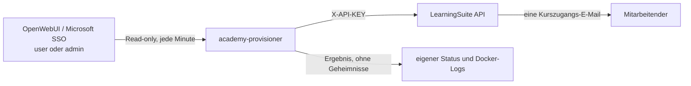

# LearningSuite Academy-Provisionierung für KAHLE-Vinci

**Status:** Design bestätigt, Spezifikationsprüfung ausstehend

## Ziel

Sobald ein Microsoft-SSO-Nutzer in KAHLE-Vinci die OpenWebUI-Rolle `user` oder `admin` erhält, wird für ihn in der KAHLE Academy ein LearningSuite-Mitglied angelegt und der Kurs **„Einführung in die KAHLE-Vinci Nutzung“** freigeschaltet.

Die erste Ausbaustufe umfasst ausschließlich die Anlage und die Kursfreischaltung. Sie deaktiviert keine Academy-Konten, entzieht keine Kurszugänge und ändert keine Academy-Administratoren.

## Fachliche Regeln

- Berechtigt sind ausschließlich OpenWebUI-Nutzer mit der technischen Rolle `user` oder `admin`.
- Nutzer mit `pending` werden weder an LearningSuite übertragen noch dort angelegt.
- Die Microsoft-E-Mail-Adresse ist die eindeutige fachliche Identität in LearningSuite.
- Der angelegte LearningSuite-Nutzer bleibt Academy-Lernender. Die OpenWebUI-Rolle `admin` verleiht ausdrücklich keine Academy-Administrationsrechte.
- Der Zielkurs wird anhand seines eindeutigen, exakten Namens **„Einführung in die KAHLE-Vinci Nutzung“** aus den veröffentlichten LearningSuite-Kursen aufgelöst.
- Gibt es keinen oder mehr als einen veröffentlichten Kurs mit diesem Namen, schlägt der Abgleich fehl und vergibt keinen Zugang.
- Bei der ersten Provisionierung wird genau eine Kurszugangs-E-Mail inklusive Login-Link versendet. Eine zusätzliche allgemeine Willkommens-E-Mail wird unterdrückt, damit Mitarbeitende keine Doppelbenachrichtigung erhalten.
- Nach erfolgreicher Anlage bleibt der Nutzer unverändert, auch wenn er später in OpenWebUI zurückgestuft, deaktiviert oder gelöscht wird. Diese Fälle sind bewusst nicht Teil dieser Ausbaustufe.

## Architektur

Ein neuer interner Docker-Dienst `academy-provisioner` ist das einzige neue Modul. Seine kleine externe Schnittstelle besteht aus dem wiederkehrenden, konfigurierten Abgleich. Er hat keinen HTTP-Port und keine Benutzeroberfläche.

Der Dienst liest die OpenWebUI-Datenbank ausschließlich aus dem vorhandenen Docker-Volume `open-webui` als Read-only-Mount. Er hält seinen eigenen Bearbeitungsstatus in einem separaten Named Volume. Damit bleibt die OpenWebUI-Datenbank alleinige Quelle für Rollen und Profildaten, während der Provisioner nie in sie schreibt.



### Interne Bausteine

Der Provisioner wird in einem eigenen Paket unter `stack/academy-provisioner/` implementiert. Er enthält vier klar abgegrenzte Adapter hinter dem tiefen Modul `AcademyProvisioner.run_once()`:

- `OpenWebUIUserReader`: liest `id`, `name`, `email` und `role` aus `webui.db` und liefert nur zulässige Nutzer.
- `LearningSuiteClient`: kapselt alle HTTP-Aufrufe, den Header `X-API-KEY`, Timeouts und die Interpretation der LearningSuite-Antworten.
- `ProvisioningStateStore`: speichert pro OpenWebUI-`user_id` die LearningSuite-`member_id`, den Erfolg der Kursfreischaltung, den letzten Fehler und die Zeitpunkte.
- `AcademyProvisioner`: orchestriert die fachliche Reihenfolge und ist die einzige Schnittstelle des Workers und seiner Tests.

Diese Aufteilung hält SQLite-Details, API-Aufrufe, Zustandsverwaltung und Geschäftsregel lokal. Die Worker-Schleife kennt nur `run_once()` und das konfigurierbare Intervall.

## Datenfluss und Ablauf

Der Worker startet beim Containerstart und danach alle 60 Sekunden.

1. Er liest alle OpenWebUI-Nutzer mit Rolle `user` oder `admin`.
2. Er validiert E-Mail-Adresse und Namen. Aus dem OpenWebUI-Anzeigenamen wird der erste nichtleere Namensbestandteil als Vorname und der verbleibende Text als Nachname verwendet. Fehlt einer der beiden Teile, wird der Nutzer nicht provisioniert und mit einem klaren Fehlerstatus für den nächsten Lauf markiert.
3. Er ruft einmal pro Lauf `GET /courses/published` auf und löst den Zielkurs über den exakten Namen auf. Die resultierende `courseId` wird für diesen Lauf verwendet.
4. Er sucht das Academy-Mitglied per `GET /members/by-email` oder legt es per `POST /members` an. Bei der Anlage gelten `ignoreIfAlreadyExists: true`, `disableLoginEmail: true` und `locale: "de"`.
5. Er prüft per `GET /members/{memberId}/courses`, ob bereits ein wirksamer Zugang zum Zielkurs besteht.
6. Fehlt der Zugang, ruft er `PUT /members/{memberId}/courses` mit der `courseId`, `disableAccessNotificationEmail: false` und `sendLoginLinkInCourseEmail: true` auf.
7. Erst wenn Mitglied und Kurszugang bestätigt sind, speichert er den Nutzer als erfolgreich provisioniert.

Der Abgleich ist damit für Wiederholungen sicher: Ein bereits existierendes Mitglied wird nicht doppelt erstellt, und ein vorhandener Kurszugang löst keine erneute E-Mail aus. Nach einem Containerabbruch zwischen API-Aufruf und Statusspeicherung prüft der nächste Lauf zuerst den tatsächlichen Kurszugang.

## Konfiguration und Sicherheit

Die folgenden Werte werden ausschließlich auf dem Vinci-Server in `stack/.env.production` gespeichert. Sie gehören nicht in Git, in eine n8n-Konfiguration oder in Logs.

```dotenv
LEARNINGSUITE_API_KEY=<LearningSuite-API-Key>
LEARNINGSUITE_API_BASE_URL=https://api.learningsuite.io/api/v1
LEARNINGSUITE_COURSE_NAME=Einführung in die KAHLE-Vinci Nutzung
LEARNINGSUITE_PROVISION_INTERVAL_SECONDS=60
```

Der Docker-Dienst erhält nur diese Umgebungsvariablen, seinen eigenen Statusspeicher und das `open-webui`-Volume als `:ro`. Er veröffentlicht keinen Port, erhält keine OpenWebUI-Admin-Credentials und keine Schreibberechtigung auf das OpenWebUI-Volume. Das API-Limit von LearningSuite (120 Anfragen pro Minute) wird mit dem Einzelworker und den erwarteten Nutzerzahlen deutlich unterschritten.

Logs enthalten nur eine technische Ereigniskennung, die OpenWebUI-`user_id`, den Ergebnisstatus und eine gekürzte Fehlerklasse. API-Key, vollständige API-Antworten und personenbezogene Daten wie E-Mail und Name werden nicht geloggt.

## Fehlerverhalten und Betrieb

- Ist die LearningSuite-Konfiguration unvollständig, startet der Worker nicht erfolgreich und meldet den Konfigurationsfehler eindeutig.
- Bei Netzwerk-, 429- oder 5xx-Fehlern bleibt der Nutzer offen. Der nächste Intervalllauf versucht es erneut.
- Bei fachlichen Fehlern wie ungültiger E-Mail, unvollständigem Namen oder nicht eindeutigem Kursnamen wird kein Zugang vergeben. Der Fehler bleibt im Statusspeicher sichtbar und wird bei jeder Änderung beziehungsweise bei späteren Läufen erneut geprüft.
- Ein Fehler eines Nutzers blockiert nie die Provisionierung weiterer Nutzer.
- Der Dienst schreibt bei jedem erfolgreich abgeschlossenen Lauf eine Herzschlagdatei in sein eigenes Statusvolume. Ein Docker-Healthcheck überwacht diese Datei.

## Tests und Abnahme

Die Umsetzung erhält isolierte Pytest-Tests mit Fake-Adaptern. Reale LearningSuite-Zugangsdaten werden in Tests nie verwendet.

Pflichtfälle:

1. `pending` wird ignoriert.
2. `user` und `admin` werden jeweils provisioniert.
3. Ein neues Mitglied wird mit E-Mail, Vorname und Nachname angelegt und erhält den Zielkurs.
4. Ein vorhandenes Mitglied erhält nur den fehlenden Kurszugang.
5. Ein vorhandener Kurszugang führt zu keinem weiteren Kurs-E-Mail-Aufruf.
6. Kein oder mehrere Kurse mit exakt gleichem Namen verhindern die Provisionierung.
7. Ungültige E-Mail oder unvollständiger Name werden sicher zurückgestellt.
8. Ein temporärer API-Fehler eines Nutzers blockiert andere Nutzer nicht und wird später erneut versucht.
9. Der Compose-Vertrag prüft Read-only-Mount, fehlende Portfreigabe, Pflichtvariablen und die Geheimnisbehandlung.

Die produktive Abnahme erfolgt danach mit einem eigens angelegten Testnutzer: zunächst `pending`, dann Umstellung auf `user`, Prüfung der einzelnen Kurszugangs-E-Mail und Sichtprüfung des Kurses in der KAHLE Academy. Anschließend wird der Dienst mit einem bereits erfolgreich provisionierten Nutzer erneut ausgeführt. Es darf keine zweite E-Mail entstehen.

## Nicht enthalten

- Entzug eines Academy-Zugangs bei Rückstufung, Deaktivierung oder Löschung in OpenWebUI.
- Synchronisierung nachträglicher Namens- oder E-Mail-Änderungen.
- Academy-Administratorrollen oder Team-Mitglieder.
- Rückkanal von Academy-Lernfortschritt nach OpenWebUI.
- Weitere Vinci-Kurse, Bundles oder Lernpfade.

Diese Punkte können später als eigene Ausbaustufe auf derselben Modul- und Zustandsstruktur ergänzt werden.

## Referenzen

- [LearningSuite API Docs 1.23.2](https://api.learningsuite.io/api/v1/docs/1.23.2/)
- `docs/research/2026-08-17-learningsuite-openwebui-provisioning.md`
- `stack/docker-compose.yml`
